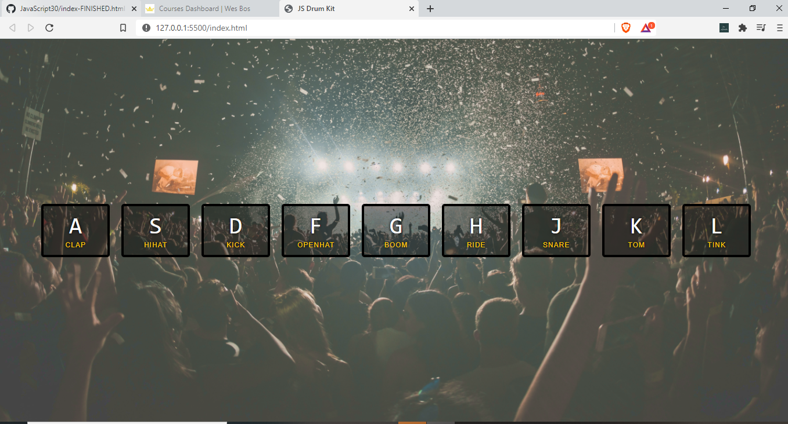

## This is an Instrument Emulator ( Javascript Drum Kit)

- Made with :heart: using ```HTML, CSS and Javascript```
- We have used audio files here, refer the sounds folder

- This is made with reference to the Javascript30 series by Wesbos
- This is project is a part of MLH Local Hack Day : Share Challenge

### Output 




- Feel free to fork it and add a :star: